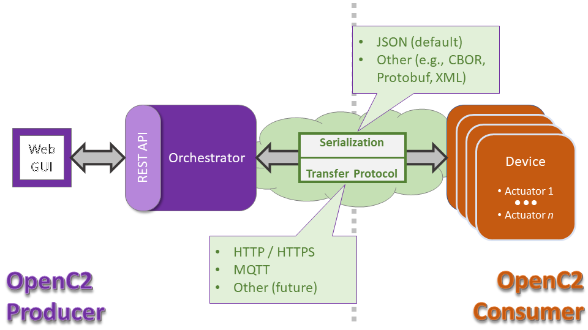

#  OpenC2 Integration Framework Device

##  Installation

To get started with the OpenC2 Integration Framework (OIF) Device please reference the [WalkThrough.md](docs/WalkThrough.md) found under docs.

##  Background

This GitHub public repository [openc2-oif-device](https://github.com/oasis-open/openc2-oif-device) was created at the request of the [OASIS OpenC2 Technical Committee](https://www.oasis-open.org/committees/openc2/) as an [OASIS TC Open Repository](https://www.oasis-open.org/resources/open-repositories/) to support development of open source resources related to Technical Committee work.

While this TC Open Repository remains associated with the sponsor TC, its development priorities, leadership, intellectual property terms, participation rules, and other matters of governance are separate and distinct from the OASIS TC Process and related policies.

All contributions made to this TC Open Repository are subject to open source license terms expressed in [Apache License v 2.0](https://www.oasis-open.org/sites/www.oasis-open.org/files/Apache-LICENSE-2.0.txt). That license was selected as the declared [Applicable License](https://www.oasis-open.org/resources/open-repositories/licenses) when the TC voted to create this Open Repository.

As documented in [Public Participation Invited](https://github.com/oasis-open/openc2-oif-device/blob/master/CONTRIBUTING.md#public-participation-invited), contributions to this TC Open Repository are invited from all parties, whether affiliated with OASIS or not. Participants must have a GitHub account, but no fees or OASIS membership obligations are required.  Participation is expected to be consistent with the [OASIS TC Open Repository Guidelines and Procedures](https://www.oasis-open.org/policies-guidelines/open-repositories), the open source [LICENSE.md](LICENSE.md) designated for this particular repository, and the requirement for an [Individual Contributor License Agreement](href="https://www.oasis-open.org/resources/open-repositories/cla/individual-cla) that governs intellectual property.

##  Statement of Purpose

OpenC2 Integration Framework (OIF) is a project that will enable developers to create and test OpenC2 specifications and implementations without having to recreate an entire OpenC2 ecosystem.

OIF consists of two major parts. The "orchestrator" which functions as an OpenC2 producer and the "Device" which functions as an OpenC2 consumer.

This particular repository contains the code required to set up an OpenC2 Device. The Orchestrator repository can be found [here](https://github.com/oasis-open/openc2-oif-orchestrator). Due to port bindings it is recommended that the orchestrator and the device not be run on the same machine.

The OIF Device was created with the intent of being an easy-to-configure OpenC2 consumer that can be used in the creation of reference implementations. To that end it allows for the addition of multiple actuators, serializations, and transportation types.

##  Overview

### Further Documentation

-  [Device](docs/Device.md)

-  [Actuator](docs/Actuator.md)

-  [Serializations](docs/Serializations.md)

-  [Transport](docs/Transport.md)

##  Maintainers

TC Open Repository [Maintainers](https://www.oasis-open.org/resources/open-repositories/maintainers-guide) are responsible for oversight of this project's community development activities, including evaluation of GitHub [pull requests](https://github.com/oasis-open/openc2-oif-orchestrator/blob/master/CONTRIBUTING.md#fork-and-pull-collaboration-model) and [preserving open source principles of openness and fairness](https://www.oasis-open.org/policies-guidelines/open-repositories#repositoryManagement). Maintainers are recognized and trusted experts who serve to implement community goals and consensus design preferences.

Initially, the associated TC members have designated one or more persons to serve as Maintainer(s); subsequently, participating community members may [select additional or substitute Maintainers](https://www.oasis-open.org/resources/open-repositories/maintainers-guide#additionalMaintainers).

*Current Maintainers of this TC Open Repository*

- David Lemire; GitHub ID: [https://github.com/dlemire60](https://github.com/dlemire60) WWW: National Security Agency
- The ScreamingBunny Development team; GitHub ID: [https://github.com/ScreamBun](https://github.com/ScreamBun)

##  About OASIS TC Open Repositories

- [TC Open Repositories: Overview and Resources](https://www.oasis-open.org/resources/open-repositories)
- [Frequently Asked Questions](https://www.oasis-open.org/resources/open-repositories/faq)
- [Open Source Licenses](https://www.oasis-open.org/resources/open-repositories/licenses)
- [Contributor License Agreements (CLAs)](https://www.oasis-open.org/resources/open-repositories/cla)
- [Maintainers' Guidelines and Agreement](https://www.oasis-open.org/resources/open-repositories/maintainers-guide)

## Feedback

Questions or comments about this TC Open Repository's activities should be composed as GitHub issues or comments. If use of an issue/comment is not possible or appropriate, questions may be directed by email to the Maintainer(s) <a href="#currentMaintainers">listed above</a>. Please send general questions about TC Open Repository participation to OASIS Staff at repository-admin@oasis-open.org and any specific CLA-related questions to repository-cla@oasis-open.org.

[Top of Page](#openC2-integration-framework-device)